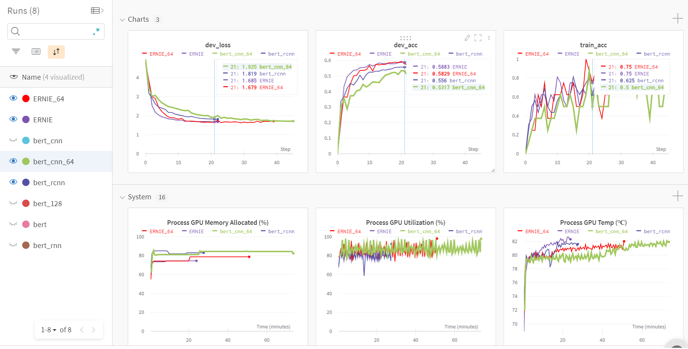

# Bert/ERNIE Chinese Text Classification Pytorch
[](https://github.com/996icu/996.ICU/blob/master/LICENSE)

Chinese Text Classification using BERT (Bidirectional Encoder Representation from Transformers), BERT variants and ERNIE (Enhanced Language Representation with Informative Entities), implemented by PyTorch, monitored training by WandB (Weights & Biases)

## Monitoring


Weights & Biases is the machine learning platform for developers to build better models faster. Use W&B's lightweight, interoperable tools to quickly track experiments, version and iterate on datasets, evaluate model performance, reproduce models, visualize results and spot regressions, and share findings with colleagues. For details please [click](https://wandb.ai/site).

## Platform
Machine：1 GTX 1650 MaxQ 4GB RAM，batch size * padding size <= 512. If GPU's RAM >= 4GB, you are suggested to enlarge the padding size and batch size (power of 2, 2^n). Average training period：25 - 45mins

## Envrionment 
python 3.7
### Library (Pip install OR Conda install )  
pytorch 1.1  
tqdm  
sklearn  
tensorboardX  
bota3 
wandb (model monitoring)  
matplotlib (EDA)  
~~pytorch_pretrained_bert~~ (pretrained package is uploaded, this repository is not required)  


## Chinese Dataset
Chinese GLUE public challenge 

119 Classes：打車
地圖導航
免費WIFI
租車
同城服務
快遞物流
婚慶
家政
公共交通
政務
社區服務
薅羊毛
魔幻
仙俠
卡牌
飛行空戰
射擊遊戲
休閒益智
動作類
體育競技
棋牌中心
經營養成
策略
MOBA
輔助工具
約會社交
即時通訊
工作社交
論壇圈子
婚戀社交
情侶社交
社交工具
生活社交
微博博客
新聞
漫畫
小說
技術
教輔
問答交流
搞笑
雜誌
百科
影視娛樂
求職
兼職
視頻
短視頻
音樂
直播
電台
K歌
成人
中小學
職考
公務員
英語
視頻教育
高等教育
成人教育
藝術
語言(非英語)
旅游資訊
綜合預定
民航
鐵路
酒店
行程管理
民宿短租
出國
工具
親子兒童
母嬰
駕校
違章
汽車諮詢
汽車交易
日常養車
行車輔助
租房
買房
裝修家居
電子產品
問診掛號
養生保健
醫療服務
減肥瘦身
美妝美業
菜譜
餐飲店
體育咨訊
運動健身
支付
保險
股票
借貸
理財
彩票
記賬
銀行
美顏
影像剪輯
攝影修圖
相機
繪畫
二手
電商
團購
外賣
電影票務
社區超市
購物諮詢
筆記
辦公
日程管理
女性
經營
收款
其他

Dataset Segmentation：

Dataset|Rows
--|--
Train|12k
Valid|2.5k
Test|2.5k


### Update Your Own dataset 
 - Formatize the Chinese dataset to specified format
 - txt file format, each row: {1 text}{1 tab space}{label id}
- provided code for transform json file into text file 
  - json file format, each row: {"label":"11","label_des":"class","sentence":"xxx"}

## Result

Model|Accuracy|#words in sentence (padding size)|Remarks 
--|--|--|--
bert|53.83%|32|
bert|55.18%|128|
bert_CNN|58.25%|32|bert + CNN
bert_CNN|58.21%|64|bert + CNN  
bert_RCNN|55.91%|32|bert + RCNN  
ERNIE|58.95%|32|ERNIE
ERNIE|59.25%|64|ERNIE  

Previous test on models including TextCNN, TextRNN, TextRNN+Att, TextRCNN, DRCNN and Transformer, those performance are worse than that of BERT family and ERNIE models. BERT models with connected components are slightly better than pure BERT model. ERNIE model is the best among those models.

## Model Introduction

### BERT  


### ERNIE  


## pretrained language model 
BERT related documents are located at directory /bert_pretain，ERNIE are at /ERNIE_pretrain，those documents should be existed for both directories：
 - pytorch_model.bin  
 - bert_config.json 
 - vocab.txt  

## Pretrained model download sites:  
bert_Chinese: model https://s3.amazonaws.com/models.huggingface.co/bert/bert-base-chinese.tar.gz  
              Vocab https://s3.amazonaws.com/models.huggingface.co/bert/bert-base-chinese-vocab.txt 或
                    https://huggingface.co/ckiplab/bert-base-chinese/tree/main

from [here](https://github.com/huggingface/pytorch-transformers)   
spare：model：https://pan.baidu.com/s/1qSAD5gwClq7xlgzl_4W3Pw

ERNIE_Chinese: http://image.nghuyong.top/ERNIE.zip  
from [here](https://github.com/nghuyong/ERNIE-Pytorch)  
spare：model：http://pan.nghuyong.top/#/s/y7Uz
(ERNIE_pretrain file rename: config.json-> bert_config.json)

After decompression, all required files in pretrain directories are ready.

## Instruction
This repository is built for feeding json text file. All json files are supposed to locate at THUCNews/data directory.

```
# json_to_txt will generate files (train.txt, dev.txt, test.txt and test2.txt) based on provided json files in THUCNews/data
python json_to_txt.py --datafile THUCNews/data

# model training requires train set (train.txt), validation set (dev.txt), test set with labels (remarks test.txt and dev.txt are the same)

# model inference requires test set (test2.txt)
```
Execution after download pretrained models
```
# Train：
## model options: bert, bert_CNN, bert_RNN, bert_RCNN, bert_DPCNN, ERNIE
# bert
python run.py --model bert

# bert + other extensions
python run.py --model bert_CNN

# ERNIE
python run.py --model ERNIE

# Choose one of models for inference (THUCNews/saved_dict)存在的model.ckpt
## model options: bert, bert_CNN, bert_RNN, bert_RCNN, bert_DPCNN, ERNIE
python pred.py --model ERNIE
# generate test_pred.json as the inference result
```

## WandB
```
pip install wandb
wandb login 
# input API key in login page into cmd prompt

# before training, you could rename your experiment in models/bert_xxx.py, modify model_name(line 12), this name would be recorded as the name of experiment in WandB page. 

# Open WandB repository page to monitor training process
```

### Parameters
All models under directory /models，including hyperparameters and model architectures.

## TBC
 - Add model explanation part using SHAP values 
 - Display SHAP plots on WandB


## Paper
[1] BERT: Pre-training of Deep Bidirectional Transformers for Language Understanding [paper](https://arxiv.org/abs/1810.04805) 

[2] ERNIE: Enhanced Representation through Knowledge Integration [paper](https://arxiv.org/pdf/1905.07129.pdf)
